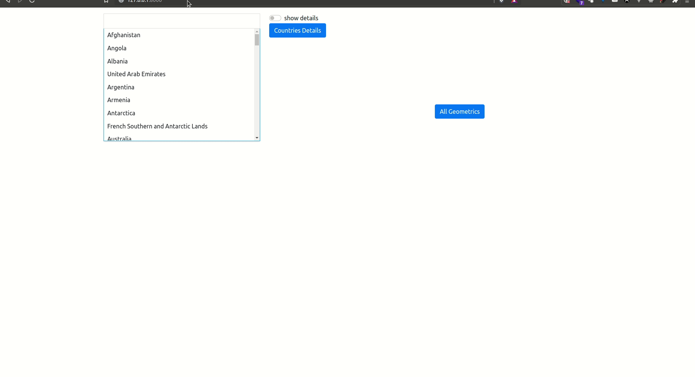

# GeoJSON API

## Overview

the following project serve geojson file into an restfulAPI using [FastAPI](https://fastapi.tiangolo.com/)

- search for specific list of countries using [Tagify](https://yaireo.github.io/tagify/)
- generate map based on the geojson file provided [Folium](https://python-visualization.github.io/folium/index.html)


## Regular Setup

### Requirements

- [x] [Python 3.x](https://www.python.org/downloads/)
- [x] [pip3](https://www.linuxscrew.com/install-pip)

### Installing dependencies

```bash
pip3 install -r requirements.txt
```

### Running the app

```bash
uvicorn main:app --reload
```

## Containerized Setup

### Requirements

- [x] [Docker](https://www.docker.com/get-started)

### Running the container

1. build the image

```bash
docker build -t geojson-api .
```

2. start the container

```bash
docker run -d --name geojson-api-instance -p 8000:8000 geojson-api
```

⚠ **P.S:  take into consideration that you don't have third-party apps running on port `8000`**